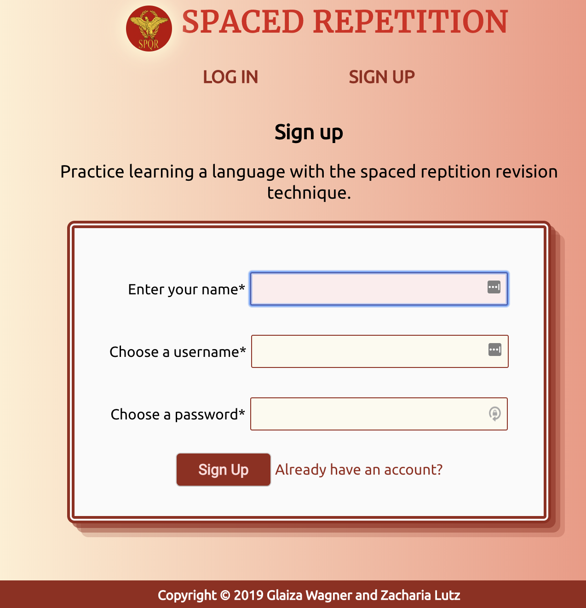
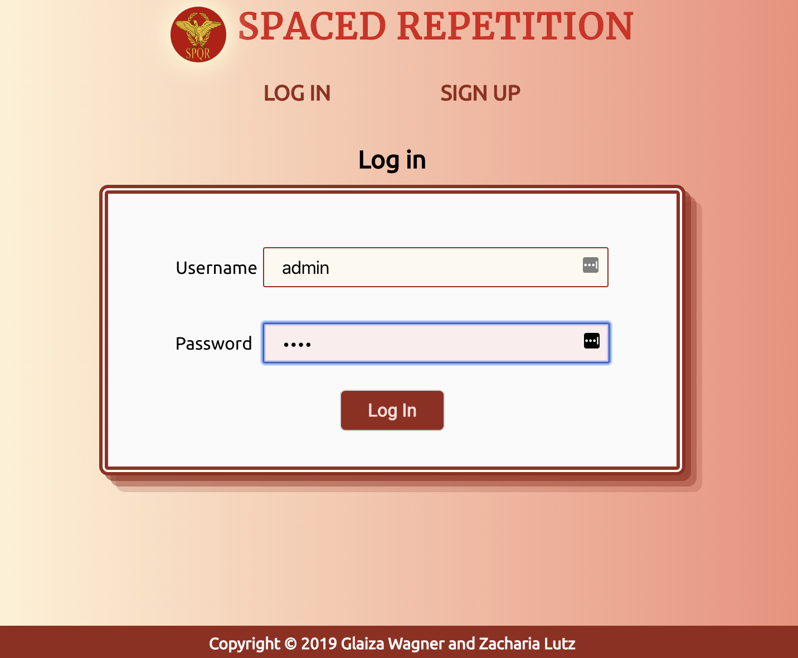
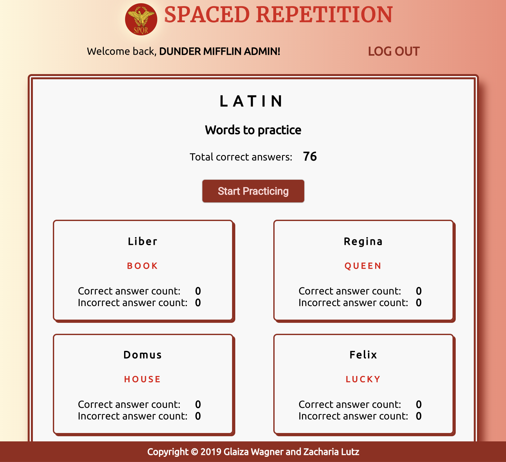
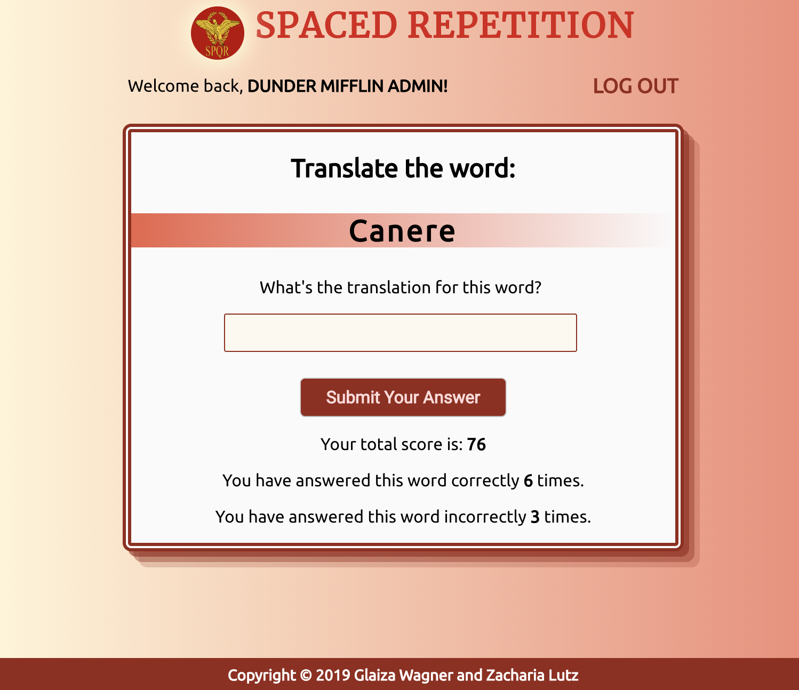
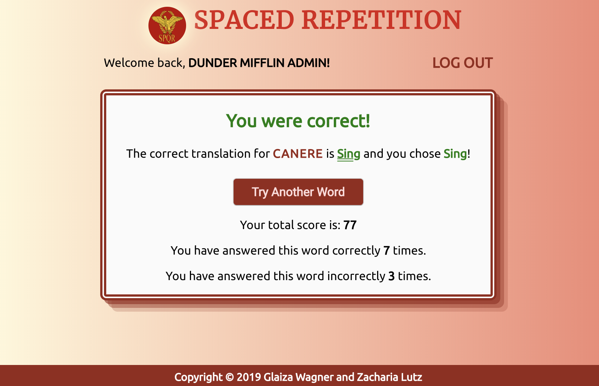
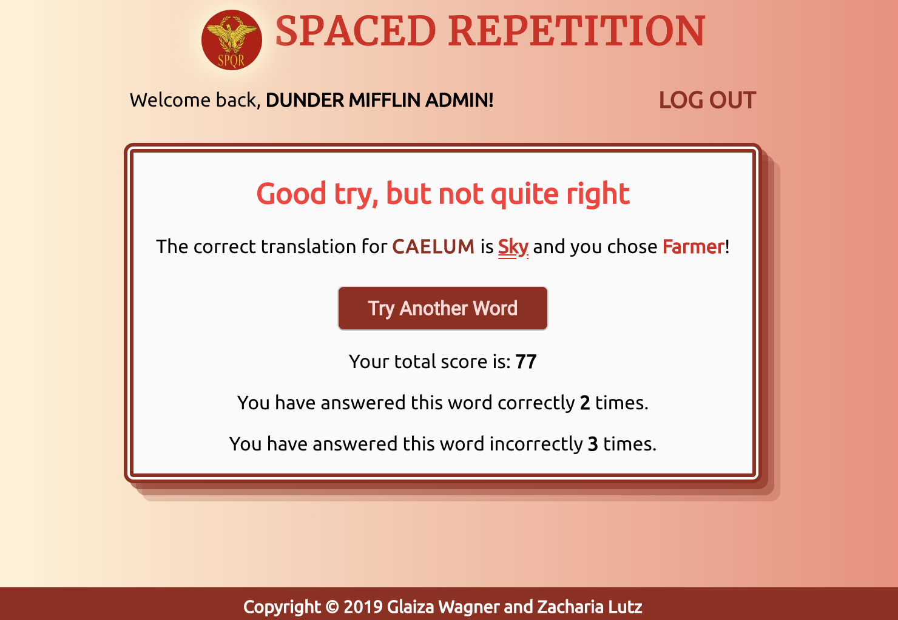

## Project Name: Spaced-Repetition client

Use the spaced-repetition technique to learn twenty Latin words.

It is a collaboration between [Glaiza Wagner](https://github.com/glaizawagner) and [Zacharia Lutz](https://github.com/zacharialutz).

- [Live app](https://gz-spaced-repetition-app.now.sh)
- [Heroku](https://glaiza-zac-spaced-rep-server.herokuapp.com)
- [Client-repo](https://github.com/thinkful-ei-heron/spaced-repetition_Zac-Glaiza_client)
- [Server-repo](https://github.com/thinkful-ei-heron/spaced-repetition_Zac-Glaiza_server)

## Account login for demo

&ensp;username: admin  
&ensp;password: pass

## Screenshots

&ensp;Sign up Page

&ensp;Log in Page

&ensp;Dashboard

&ensp;Learning Page

&ensp;Learning Page - correct answer

&ensp;Learning Page - incorrect answer

## Technologies
- HTML5
- CSS3 
- React
- Javascript
- Cypress
- JWT-Decode

Client - Deployed in Zeit  
Server - Deployed in Heroku 

Copyright © G&Z 2020